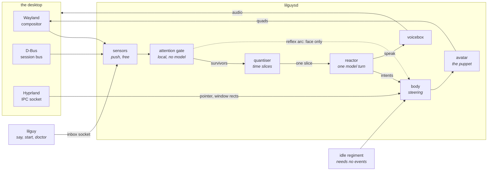
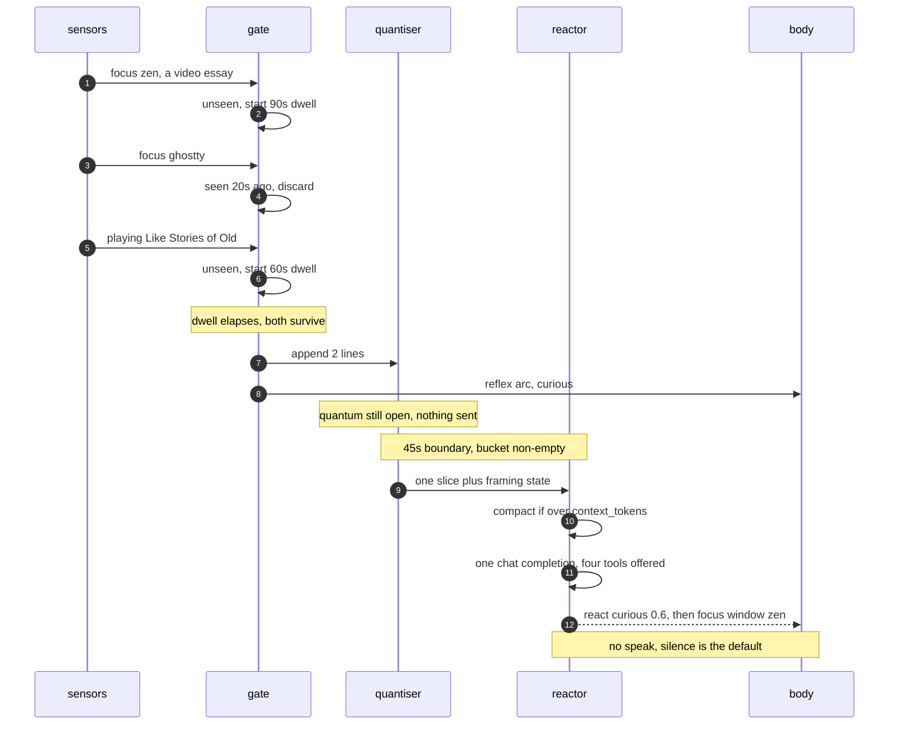
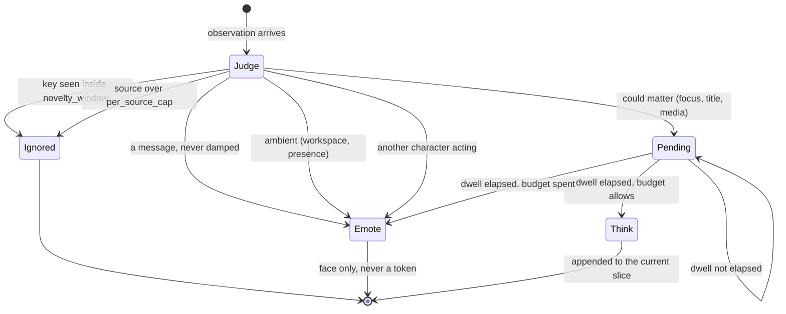
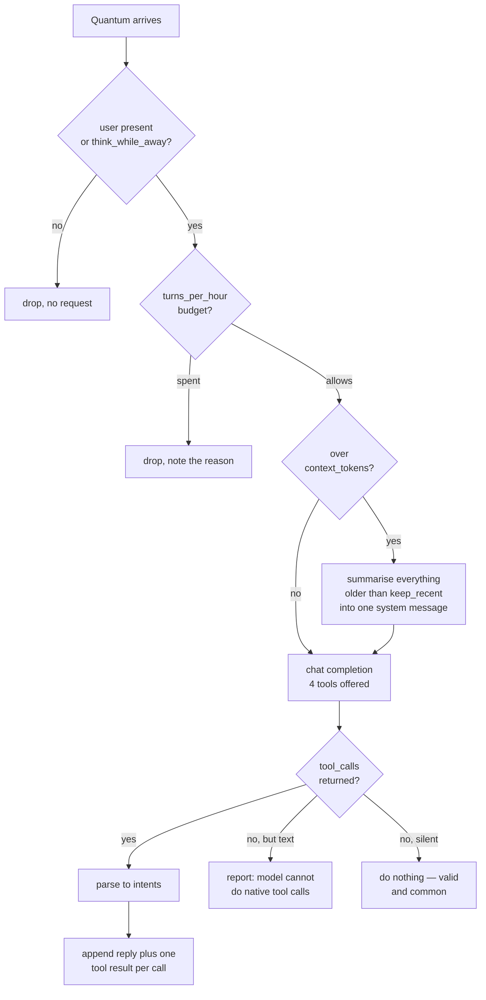
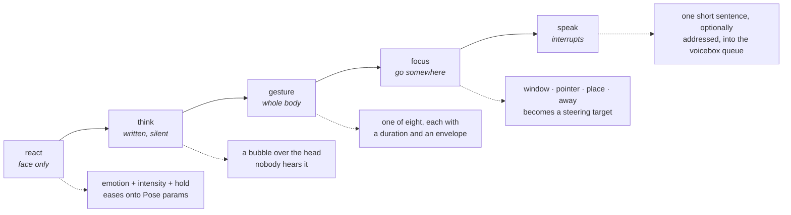
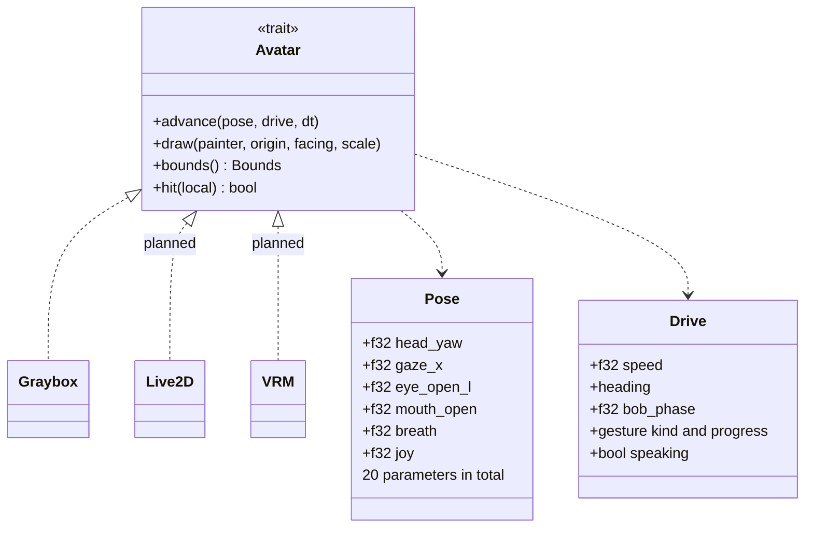
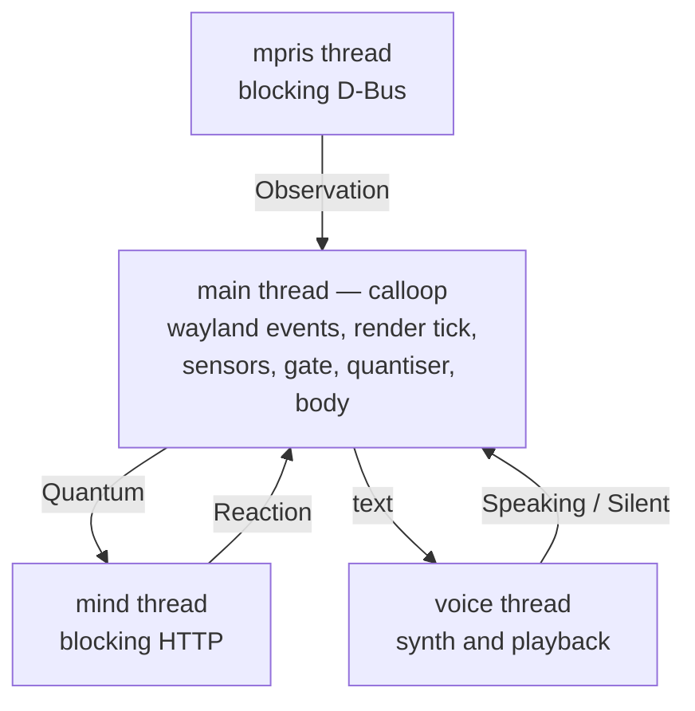

# lilguys — architecture

One daemon, `lilguysd`. It draws **any number of characters** on a Wayland overlay, senses what
happens on the desktop, and lets a language model decide what each of them does about it. Every guy
has his own gate, his own context window and optionally his own model; they share the surface, the
senses, and everything each other does. See [todo/many-guys.md](todo/many-guys.md).

Everything below describes what the code does today. **[philosophy.md](philosophy.md) says what it
is held to** — the mind/body split, the two kinds of sensing, and the six things a change may not
break. Measurements behind these choices are in [design-space.md](design-space.md); the manual
checks are in [qa-graybox.md](qa-graybox.md).

## 1. The shape of it



Two properties shape every decision:

- **Cheap things happen often, expensive things happen rarely.** The sensors are push-based and
  cost nothing. The gate is local arithmetic. Only the reactor spends tokens, and it is fed on a
  slow clock with a hard ceiling.
- **The mind never touches pixels or protocols.** It emits five kinds of intent. Everything about
  how those look is below the `Avatar` trait, and everything about where the character goes is in
  the body.

## 2. Three clocks

Nothing in lilguys runs on one loop. Three run at very different rates, and each only escalates to
the next when it has to.

| clock | rate | cost | what it does |
|---|---|---|---|
| reflex | 60 Hz awake, 8 Hz idle | none | drift, gaze, blink, breathing, click, drag |
| notice | per event | none | novelty and dwell filtering, the reflex arc |
| think | one slice, at most | tokens | the model decides what to actually do |

The reflex clock is the render tick. It drops to 8 Hz whenever the character is settled and nothing
is animating, which is most of the time.

Two distinct things run without a model, and they are easy to confuse:

- **The idle regiment** needs no events at all. Breathing, blinking on an interval deliberately
  irrational against the breath cycle, the figure-of-eight float, gaze tracking with eyes leading
  head leading body, turning to face a pointer that stays behind him, and `wander_per_minute`. All
  of it lives in `locomotion.rs` and runs on every tick. This is what keeps him alive when nothing
  whatsoever is happening.
- **The reflex arc** is event-driven: the gate hands an observation straight to the body, skipping
  the model entirely. See §4.1.

## 3. What "quantised event flow" means

**Fixed-length time slices.** Events do not stream to the model. They accumulate in a bucket for a
whole quantum — 45 seconds by default, 10 minutes once the user is away — and the bucket is then
rendered as one short report. One slice is at most one model turn.

Three rules make it economical:

1. **An empty slice is never sent.** If nothing survived the gate during the window, no request is
   made at all. Silence costs nothing and is the common case.
2. **The window widens when the user leaves.** `idle_quantum` replaces `quantum` the moment the
   idle notifier fires, so an unattended machine costs almost nothing.
3. **A slice can still be refused.** `turns_per_hour` is a refilling budget on top of the clock; a
   busy hour cannot spend more than its allowance no matter how many slices fill up.



**A message is the one thing that does not wait.** Every other observation may sit in the bucket
for a whole quantum because nothing is waiting on it; a person who has just typed is. So a message
closes the current slice immediately and sends it, with everything accumulated so far — what he was
in the middle of noticing is exactly the context for what was just said. This is the only legitimate
override of the pace, and anything else that wants to jump the queue is argued against this
precedent.

Every slice opens with two framing lines carrying **state rather than events** — how long the
window was, whether the user is present, the active workspace, the focused window, and how the body
currently is:

```
[45s elapsed · they are here · workspace 2 · they are looking at zen — a video essay]
[you are settled by zen, feeling curious 60%]
```

The second line is why interoception needs more than an event stream: a feeling that never changes
is still true, and only a framing line can say so. It also lets the model tell "nothing happened
because they left" from "nothing happened because they are concentrating".

## 4. The attention gate

The gate is the reason the reactor is affordable. It runs locally, spends nothing, and discards
most of what it sees.



Every observation carries a **key** — `focus:zen:<title>`, `media:<url>:<title>` — and a repeat of
the same key inside `novelty_window` is dropped outright. Alt-tabbing between two windows twenty
times produces two observations, not forty.

### 4.1 The reflex arc

Two paths reach `Verdict::Emote`, and both bypass the model:

1. **A feeling** — the body's own, or a drive's through the inbox. Always answered, never rationed:
   budget protects tokens, and an expression costs none.
2. **A message** — somebody typed at him. Never damped, never deduplicated and never dropped: a
   person repeating themselves means it twice, which is the opposite of nothing new.
3. **Another character acting** — free like a feeling, because it is somebody else's whole point in
   being here. What stops a cast amplifying is `per_source_cap`, which damps one guy monologuing
   without silencing the rest.
4. **Ambient observations** — a workspace switch or a presence change. These colour the mood but are
   never worth a token on their own. They can flood, so unlike feelings they are rationed.
5. **A demoted thought** — a dwell matured, but `turns_per_hour` was already spent. Rather than
   discard it, the verdict drops from Think to Emote so something visible still happens.

The answer is a fixed mapping from observation to expression, applied directly to the body:

| observation | expression | hold |
|---|---|---|
| user came back | pleased 0.55 | 6 s |
| user went away | sleepy 0.70 | 30 s |
| workspace switched | curious 0.30 | 3 s |
| focus changed | curious 0.45 | 5 s |
| window retitled | curious 0.22 | 2.5 s |
| playback started | amused 0.45 | 8 s |
| playback stopped | neutral 0.20 | 3 s |
| somebody typed at him | curious 0.60 | 6 s |
| another character acted | curious 0.35 | 5 s |
| any feeling | whatever it named | whatever it asked |

**Facial only, on purpose.** A gesture is a deliberate intention and stays the mind's to decide, so
the worst this layer can do with the model unreachable is pull a face. It never moves him, never
speaks, and never spends anything.

**Every reflex records itself.** Applying an expression also pushes an interoceptive line back onto
the bus, so the next slice carries both the cause and what he did about it before he knew:

```
- you feel starving (hunger) — nothing since this morning
- you found yourself looking concerned at starving
```

Those records are marked reflective and are exempt from the reflex arc — otherwise reacting to a
reaction would never terminate. See [philosophy.md](philosophy.md).

Dwell is what stops the buddy reacting to things you passed through. A window must hold focus for
`focus_dwell`; a track must play for `media_dwell`. Skipping a video means its transcript is never
worth fetching, and the gate is where that is decided.

## 5. Senses

Each sensor is one source, and each is independently switchable in `[senses]`. None of them poll,
and none of them look at pixels.

Sensing divides in two, and the division is load-bearing rather than tidy — see
[philosophy.md](philosophy.md). **Exteroception** is the world; **interoception** is the body
reporting on itself. Both push onto the same bus and reach the mind in the same account.

| sensor | kind | source | gives |
|---|---|---|---|
| windows | extero | `zwlr_foreign_toplevel_manager_v1` | focus changes, app ids, live titles |
| workspaces | extero | `ext_workspace_manager_v1` | which workspace is active, switch events |
| idle | extero | `ext_idle_notifier_v1` | user went away, user came back |
| media | extero | MPRIS on D-Bus | title, artist, and **the URL** of whatever is playing |
| pointer | extero | Hyprland IPC | cursor position, 14.6 µs per read |
| geometry | extero | Hyprland IPC | window rectangles, for `focus(window)` |
| body | intero | `locomotion.rs` | picked up, set down, arrived, out of sight |
| others | extero | the roster | what another character just said, thought or did |
| inbox | intero | `$XDG_RUNTIME_DIR/lilguys.sock` | any feeling any process cares to push |
| inbox | extero | the same socket | a message typed at them, from `lilguy say` or anything else |

### 5.1 The inbox

One JSON object per line, from anything that can open a unix socket. Two shapes go in, and which
one a line is depends on the fields it carries — a feeling needs `source` and `state`, a message
needs `text`:

```json
{"source":"hunger","state":"starving","detail":"nothing since this morning",
 "tone":"concerned","intensity":0.9,"hold":40}
{"text":"are you two getting along?","to":"SpongeBob"}
```

A message is heard by everybody in the room. `to` decides who reads it as being addressed — that
one answers on the next tick, the rest hear it at their own pace. `lilguy say --to …` writes
exactly this line, which is why the message path was testable before there was anywhere to type.

`tone`, `intensity` and `hold` set the immediate expression, because only the drive's author knows
what its own signal means. A feeling is answered by the body at once and **never rationed** — it
costs no tokens — and it still rides into the next slice for the mind to reflect on later.

A feeding mechanic is therefore a script with a timer, outside this repo entirely.

The Wayland sensors ride the same connection as the surface — no second socket, no second thread.
MPRIS gets its own thread because D-Bus is blocking and a stalled bus must never stall rendering.

Media is the sense that matters most and costs least. A `PropertiesChanged` signal carries
`xesam:url`, so a YouTube watch id arrives as a free push event and a transcript is one HTTP call
away. No screen capture, no OCR, no browser extension.

## 6. The reactor

Its own thread, blocking HTTP, one turn per slice.



**Context is a plain message list that compacts in place.** Above `context_tokens`, everything
older than `keep_recent` turns is sent back to the same model with a summarise instruction, and the
result replaces it as a single system message. If summarising itself fails, the old turns are
dropped anyway — the window has to shrink either way.

**Tool calls must be native.** If a model writes `react(pleased)` into the message text instead of
using the tool channel, lilguys reports that as an error rather than parsing around it.
`lilguysd --check` answers this before you ever run the daemon.

## 7. The five capabilities

The model has exactly five tools, ordered from cheap and quiet to loud and interrupting. The system
prompt says to prefer them in that order, and that calling nothing at all is a normal response.



`speak` takes an optional `to`. Everybody hears the sentence either way; the one named reads it as
*said to you* and the rest read it as *said to lil*, which is the whole difference between being
addressed and overhearing.

`focus` is the only one that needs the outside world: `focus(window, match: "zen")` looks the
rectangle up through Hyprland IPC, because no Wayland protocol will tell one client where another
client's window is. `focus(away)` sends the character off the edge of the screen on purpose.

## 8. Body and avatar

The body is steering. There is no gravity, no ground, and no jump — a lilguy floats, drifts, and
may leave the screen.

```mermaid
stateDiagram-v2
    [*] --> Idle
    Idle --> Noticing: pointer within notice_radius
    Noticing --> Idle: pointer beyond forget_radius
    Idle --> Seeking: wander, or focus() from the mind
    Noticing --> Seeking: focus() from the mind
    Seeking --> Lingering: arrived
    Lingering --> Idle: linger elapsed
    Idle --> Leaving: focus(away)
    Leaving --> Idle: offscreen and nothing to do
    Idle --> Held: clicked and dragged
    Held --> Idle: released
```



Movement is seek-with-arrival plus a slow figure-of-eight float, so he is never perfectly still.
`offscreen_margin` decides how far past the edge he may drift; only `Leaving` ignores it.

The seam below the body is one trait:



`Pose` names follow Live2D's standard parameter set, which makes the whole VTuber model corpus an
asset library and maps cleanly onto glTF morph targets. `Drive` carries what is not a facial
parameter: travel, gesture progress, and whether the mouth should be moving.

`hit()` is load-bearing beyond drawing — it produces the input region, and everything outside that
rectangle passes clicks through to whatever is underneath.

## 9. Voice

A TTS pipeline is a command line. That is the whole abstraction.

```toml
[voice.engines.piper]
synth = ["piper", "--model", "{voice}", "--length-scale", "{speed}", "--output_file", "{out}"]
play  = ["pw-play", "{out}"]
```

`{text}` `{voice}` `{speed}` `{out}` are substituted; text goes on stdin when `{text}` does not
appear in the arguments. Piper, espeak-ng, kokoro, XTTS and any OpenAI-compatible `/v1/audio/speech`
endpoint reached through `curl` are therefore the same thing to lilguys, and adding one is a config
entry rather than a code change.

Synthesis runs on its own thread with a short queue. Beyond `queue_limit` an utterance is refused
rather than queued — a buddy talking over itself is worse than one that missed a line. While it
speaks, `Drive::speaking` moves the mouth and blocks the expression layer from fighting it.

**A voice belongs to a character, not to the install.** A guy's `voice`, then their character file's,
then `[voice]`; the value is `"engine:voice"`, an engine, or a voice, so a character wanting
espeak's flatness is choosing an engine and not only a model. Two of them sharing one voice is the
fastest way to stop believing in either.

**The floor on speech is shared by the whole cast.** `speech_floor` is a minimum gap between
anybody speaking aloud, not per guy: the pace was tuned for one creature, and six of them on the
same quantum is a room that will not shut up. Faces, thoughts and movement are free and are never
held back by it. A held-back utterance is recorded in `events.jsonl` and never happened as far as
the rest of the cast is concerned — nobody witnesses an action the floor refused.

## 10. Threads



Every thread that can block owns a channel into the calloop event loop and nothing else. The main
thread never waits on D-Bus, HTTP, or a subprocess, which is why a dead endpoint or a missing TTS
binary degrades one sense instead of freezing the character.

## 11. Logs

`$XDG_STATE_HOME/lilguys/` holds two append-only JSONL files, on by default.

- **`turns.jsonl`** — one object per model turn: the slice sent verbatim, the raw `content`, the raw
  `tool_calls`, the intents parsed out, the calls **rejected** and why, token estimate, whether the
  window compacted, the error if any, and the round-trip in milliseconds.
- **`events.jsonl`** — one object per gate ruling, with its verdict, so what was discarded is as
  visible as what survived. Also every inbox line rejected as neither a feeling nor a message, and
  every utterance the shared speech floor held back.

Everything the model says is recorded before it is acted on, which is what makes misbehaviour
diagnosable rather than anecdotal.

### 11.1 Vetting speech

`speak` is the only capability that reaches the user directly, so it is the only one vetted. An
utterance is refused when it runs past 25 words, contains markup characters, or carries the tells
of a leaked prompt. Small models do leak their tool-calling preamble into `speak` — a real one
began "Given the following functions, please respond with a JSON…" and was spoken aloud before this
existed. A refusal is logged with its reason and shown as `[x] refused` rather than swallowed.

## 12. Configuration

One TOML file, `~/.config/lilguys/lilguys.toml`, naming nothing internal. A partial file is merged
onto the bundled defaults, so it need only contain what differs.

- `lilguysd --print-config` writes a fully commented starting point.
- `lilguy doctor` validates it, resolves the provider, probes the model for **native tool-call
  support**, checks the compositor offers layer-shell, and checks every character's voice — all
  without opening a surface. `lilguysd --check` prints the same report; there is one set of checks.

### 12.1 The command

`lilguysd` is the daemon and `lilguy` is what a person — or, in practice, their coding agent — talks
to. Nobody hand-configures a thing like this, so the CLI is built for a caller that is a program:
`--json` on everything, an exit code that means something, and every command safe to run twice.
`doctor` reports one line per check with the fix beside it, so a caller can repair one thing rather
than start over, and `setup` is the same checks with permission to fix them — which is what makes
running it twice a no-op. Nothing is downloaded or installed without being asked; where nobody is
there to answer, setup stops and puts the question in its output rather than guessing. See
[todo/lilguy-cli.md](todo/lilguy-cli.md).

### 12.2 The sutra

The system prompt is a **sutra** — a thread, in the literal sense of the word. It is the only part
of a character that persists: the body forgets on every restart, the context window is compacted and
discarded, but the thread is what makes this the same creature tomorrow. See
[philosophy.md](philosophy.md).

It is assembled from named strands in the order `[prompt] layers` lists them. Each is
`text = """…"""` or `file = "…"`, and `{name}` becomes the buddy's name anywhere in any of them.

| strand | answers |
|---|---|
| `rules` | what may never be done — no system text in its mouth, no repeating the report back |
| `awareness` | where it is: a desktop, a person working, no question asked, no task |
| `self` | what it is: a body that acts without it, actions learned by reading about them after |
| `persona` | who it is — the only layer worth rewriting to make a different creature |

### 12.3 Situational facts

The engine contributes what it knows as `{placeholder}` substitutions into any layer:

| fact | is |
|---|---|
| `{name}` | this character's name |
| `{others}` · `{cast}` | who else is on screen, and everyone including this one |
| `{capabilities}` | the verbs this body actually has |
| `{emotions}` · `{gestures}` | the expressions and movements it can make |
| `{size}` | how big it is on screen |

**A line whose placeholder resolves to nothing is dropped whole.** So a layer may write

```
You are not alone here. Also on this desktop: {others}.
```

and that sentence simply vanishes when a character is alone, instead of leaving a hole in itself.
One rule, no conditionals, no template language.

**Every fact must be constant for the life of the process.** Who you are and who is with you are
facts; what you are looking at is not. Anything that changes belongs in the event stream, because a
system prompt that moves is a system prompt that cannot be cached.

`lilguysd --print-prompt` prints each guy's assembled thread verbatim, facts filled in; `lilguy
doctor` prints the strand names with their lengths. Stranding exists so that rewriting a character cannot
delete a rule.

Providers are interchangeable because every one speaks the OpenAI chat-completions wire format:
llama.cpp's server, ollama, vLLM, LM Studio, OpenRouter, OpenAI. Switching between local and hosted
is a `provider = ` line. API keys are named by environment variable and never live in the file.

## 13. Not yet built

- **Memory.** Deferred by decision. The reactor's private notes are the seed for it.
- **hermes link.** Clicking the character opens a channel adapter; ambient observations become a
  plugin writing to memory rather than into a live conversation.
- **Live2D and VRM adapters**, over the same `Pose` and `Drive`.
- **Clipboard and AT-SPI senses**, both free and both push-based.
- **Per-window capture** — the only planned sense that costs anything.
