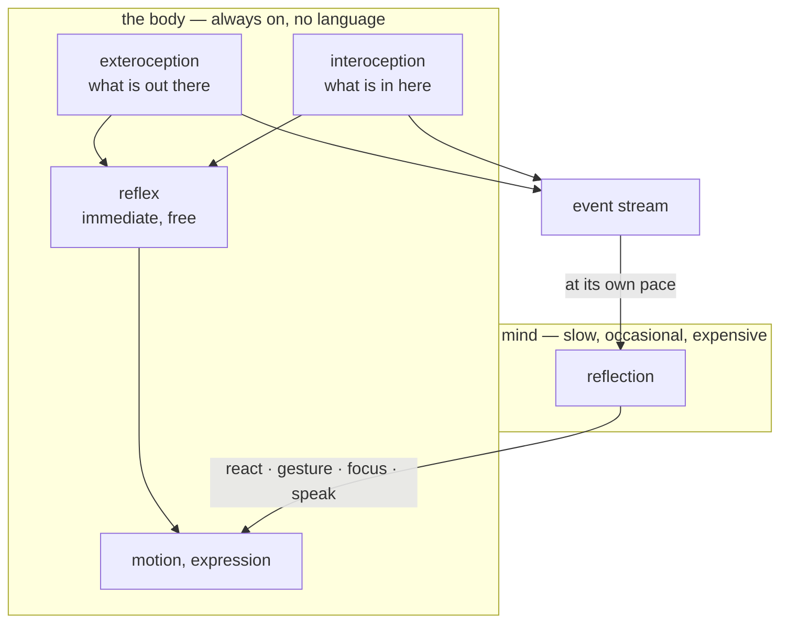

# The mind and the body

This is the design law of lilguys. It is not a description of the code — it is what the code is
held to. When a change is ambiguous, this document decides it. [architecture.md](architecture.md)
says how it is currently built; this says why, and what may not change.

## The split

A lilguy is two things that do not share a substrate.

**The body is everything automatic.** It breathes, blinks, drifts, watches the pointer, turns to
face what is behind it, and reacts to what it senses. It runs at 60 Hz. It has no language, no
memory, and no opinions. It never waits for permission and it never stops. Unplug the mind and the
body is still alive — that is the test, and it must keep passing.

**The mind is the model.** It does not perceive the desktop and it does not move anything. It reads
an account of what the body has been through, and answers with intentions. It runs on a slow clock,
minutes apart, and most of the time it declines to say anything at all.

Between them is one channel in each direction: an event stream up, four intentions down.



## Two kinds of sensing

Everything the body senses divides in two, and the division matters.

**Exteroception** is the world: which window has focus, what is playing, which workspace is up,
whether the person is still there. It arrives from Wayland and D-Bus. It is about them.

**Interoception** is itself: being picked up, being set down, arriving somewhere, drifting out of
sight, and whatever else a subsystem chooses to report — hunger, boredom, the ache of a long
uptime. It is about it.

**Both go into the same stream.** This is the load-bearing decision. The mind does not have a
special channel for feelings and a general one for observations; it reads one account in which
`focus zen — a video essay` and `you feel starving (hunger)` sit as neighbours. It learns how it
feels the same way it learns what you are doing: by reading about it, afterwards.

That is not a shortcut. It is the claim. A lilguy does not have privileged access to its own
interior. It infers its state from the record, at its own pace, exactly as it infers yours.

## The two-speed response

Every signal is answered twice, at two very different costs.

1. **The body answers immediately, for free.** A feeling produces an expression the instant it
   arrives. No model, no tokens, no waiting. This is what makes the body feel like a body: a
   consequence follows a cause without deliberation.
2. **The mind answers later, if at all.** The same signal appears in the next slice. Minutes may
   pass. The mind may decide it means nothing. It may decide it means something and shrug about
   it. It may, rarely, say a sentence.

Getting hungry makes his face fall *now*. Whether he has anything to say about being hungry is a
separate question, answered on a separate clock, and usually the answer is no.

**A free response is never rationed.** Budget exists to protect tokens. Gating an expression that
costs nothing does not save anything — it only makes the body feel dead. Ambient events from
outside are rationed because they can flood; the body's own feelings are not.

## Adding a drive

Anything that can write a line to a unix socket can give a lilguy a feeling.

```bash
echo '{"source":"hunger","state":"starving","detail":"nothing since this morning",
       "tone":"concerned","intensity":0.9,"hold":40}' \
  | socat - UNIX-CONNECT:$XDG_RUNTIME_DIR/lilguys.sock
```

`source` names the subsystem so the mind can tell a hunger from a mood. `state` is what it is.
`detail` is optional colour. `tone`, `intensity` and `hold` decide the immediate expression,
because only the drive's author knows what its own signal means.

That is the entire extension surface, and it is deliberately outside the daemon. A feeding
mechanic is a script with a timer. A weather mood is a cron job. Neither belongs in lilguys, and
neither needs to be.

## What this forbids

These follow from the split. A change that breaks one of them is wrong even if it works.

1. **The mind never reads the world directly.** No sensor result is fetched inside a model turn. If
   the mind needs to know something, the body must have put it in the stream. Otherwise the model
   becomes the perceiver and the body becomes a puppet.
2. **The body never waits for the mind.** Every reflex path must complete without a model. An
   unreachable endpoint costs the buddy its reflections, never its life.
3. **Intentions are requests, not commands.** `focus` names a place and the body finds its own way
   there. The mind must never receive coordinates and must never send them.
4. **A free response is never budgeted.** See above.
5. **Interoception uses the same channel as exteroception.** No side door, no privileged access,
   no injecting state into the prompt outside the stream. The one exception is the framing line,
   which carries *current* state rather than *changed* state — because a feeling that never changes
   is still true, and an event stream alone cannot say so.
6. **Silence is the default everywhere.** Calling no tool is correct. Sending no slice is correct.
   Discarding an observation is correct. The gate exists to make silence cheap, and every addition
   must make silence more likely, not less.

## Why the pace is the point

An always-on creature that reacts to everything is a notification system with a face. The
restraint is not an optimisation that happened to also read well — it is the character.

He notices at 60 Hz, considers every forty-five seconds, and speaks perhaps twice an hour. Each of
those numbers is a decision about what kind of thing he is. Lowering the quantum does not make him
more attentive; it makes him a chatbot in a costume.

When adding a sense, a drive, or a capability, the question is not "can he respond to this" but
"at which of the three speeds, and how much of the time should the answer be nothing".
