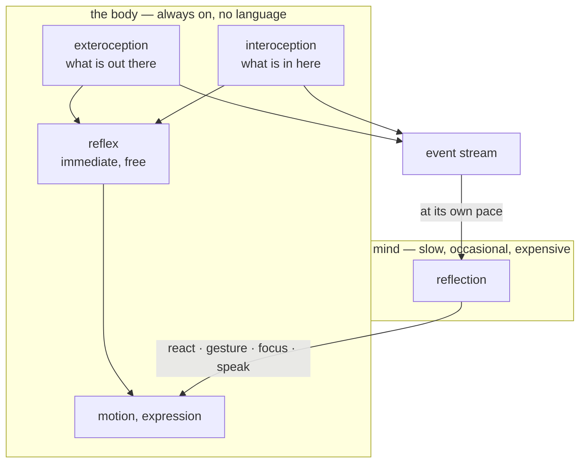

# The mind and the body

This is the design law of lilguys. It is not a description of the code — it is what the code is
held to. When a change is ambiguous, this document decides it. [architecture.md](architecture.md)
says how it is currently built; this says why, and what may not change.

## The split

A lilguy is two things that do not share a substrate.

**The body is everything automatic.** It breathes, blinks, drifts, watches the pointer, turns to
face what is behind it, and reacts to what it senses. It runs at 60 Hz. It has no language, no
memory, and no opinions. It never waits for permission and it never stops. Unplug the mind and the
body is still alive — that is the test, and it must keep passing.

**The mind is the model.** It does not perceive the desktop and it does not move anything. It reads
an account of what the body has been through, and answers with intentions. It runs on a slow clock,
minutes apart, and most of the time it declines to say anything at all.

Between them is one channel in each direction: an event stream up, four intentions down.



## Two kinds of sensing

Everything the body senses divides in two, and the division matters.

**Exteroception** is the world: which window has focus, what is playing, which workspace is up,
whether the person is still there. It arrives from Wayland and D-Bus. It is about them.

**Interoception** is itself: being picked up, being set down, arriving somewhere, drifting out of
sight, and whatever else a subsystem chooses to report — hunger, boredom, the ache of a long
uptime. It is about it.

**A reflex is not exempt from being sensed.** Every reflexive action the body takes produces its
own interoceptive record: he pulls a face without asking anyone, and *that he pulled a face* enters
the stream as a line of its own. He does not find out he reacted by inference; he reads it, the way
he reads everything else about himself.

```
- you feel starving (hunger) — nothing since this morning
- you found yourself looking concerned at starving
```

This is the whole of the self-awareness programme, and it is one line per reflex. Without it the
body is a puppet with hidden strings — things happen through him that he never learns about. With
it, the record of his life is complete: what happened, and what he did about it before he knew.

The one exemption is recursive: a record of a reflex must never provoke a reflex. It reaches the
mind like anything else and moves nothing. Awareness of a flinch is not itself a flinch.

**Both go into the same stream.** This is the load-bearing decision. The mind does not have a
special channel for feelings and a general one for observations; it reads one account in which
`focus zen — a video essay` and `you feel starving (hunger)` sit as neighbours. It learns how it
feels the same way it learns what you are doing: by reading about it, afterwards.

That is not a shortcut. It is the claim. A lilguy does not have privileged access to its own
interior. It infers its state from the record, at its own pace, exactly as it infers yours.

## The two-speed response

Every signal is answered twice, at two very different costs.

1. **The body answers immediately, for free.** A feeling produces an expression the instant it
   arrives. No model, no tokens, no waiting. This is what makes the body feel like a body: a
   consequence follows a cause without deliberation.
2. **The mind answers later, if at all.** The same signal appears in the next slice. Minutes may
   pass. The mind may decide it means nothing. It may decide it means something and shrug about
   it. It may, rarely, say a sentence.

Getting hungry makes his face fall *now*. Whether he has anything to say about being hungry is a
separate question, answered on a separate clock, and usually the answer is no.

**A free response is never rationed.** Budget exists to protect tokens. Gating an expression that
costs nothing does not save anything — it only makes the body feel dead. Ambient events from
outside are rationed because they can flood; the body's own feelings are not.

## Adding a drive

Anything that can write a line to a unix socket can give a lilguy a feeling.

```bash
echo '{"source":"hunger","state":"starving","detail":"nothing since this morning",
       "tone":"concerned","intensity":0.9,"hold":40}' \
  | socat - UNIX-CONNECT:$XDG_RUNTIME_DIR/lilguys.sock
```

`source` names the subsystem so the mind can tell a hunger from a mood. `state` is what it is.
`detail` is optional colour. `tone`, `intensity` and `hold` decide the immediate expression,
because only the drive's author knows what its own signal means.

That is the entire extension surface, and it is deliberately outside the daemon. A feeding
mechanic is a script with a timer. A weather mood is a cron job. Neither belongs in lilguys, and
neither needs to be.

## What this forbids

These follow from the split. A change that breaks one of them is wrong even if it works.

1. **The mind never reads a sensor.** Perception is pushed: if the mind is to know something, the
   body put it in the stream. The mind may not poll the world, or the model becomes the perceiver
   and the body a puppet.

   **Consequence is not perception.** A capability may answer the character who used it — "the
   grill is stone cold" — because that is the result of an action they chose, not a look at a world
   they cannot see. Perception is pushed; consequence is pulled, and only by acting.
2. **The body never waits for the mind.** Every reflex path must complete without a model. An
   unreachable endpoint costs the buddy its reflections, never its life.
3. **Intentions are requests, not commands.** `focus` names a place and the body finds its own way
   there. The mind must never receive coordinates and must never send them.
4. **A free response is never budgeted.** See above.
5. **Every reflex records itself.** A body action taken without the mind must produce an
   interoceptive line saying it happened. Adding a reflex without its record makes him unaware of
   his own behaviour, which is the one thing this design exists to prevent. Records are marked
   reflective and never trigger further reflexes.
6. **Interoception uses the same channel as exteroception.** No side door, no privileged access,
   no injecting state into the prompt outside the stream. The one exception is the framing line,
   which carries *current* state rather than *changed* state — because a feeling that never changes
   is still true, and an event stream alone cannot say so.
7. **Whatever authors the world may not author a character.** A script, a director, a plugin — any
   of them may make something *true* for a creature, however forcefully, and may define what a
   creature is *able* to do. None of them may make it *say* or *do* anything. Events in and verbs
   offered; never intents. The moment a script can put words in a mouth, the characters are puppets
   reading a screenplay and nothing above is worth having.

   The line runs between the choice and its consequence. **A world decides what happens when you
   cook a patty. It does not decide that you cooked one, and it never decides how you feel about
   how it came out.**
8. **Silence is the default everywhere.** Calling no tool is correct. Sending no slice is correct.
   Discarding an observation is correct. The gate exists to make silence cheap, and every addition
   must make silence more likely, not less.

## The prompt is layered for the same reason

The system prompt is not one document. It is four, sent in order, each answering a different
question:

1. **rules** — what may never be done. Absolute, and shortest.
2. **awareness** — where he is and what is going on. Situational fact, not instruction.
3. **self** — what kind of thing he is: that his body acts without him, that he learns his own
   actions by reading about them afterwards.
4. **persona** — who he is. The only layer worth rewriting to make a different creature.

The layering is the same principle as the mind/body split: separable concerns must be separately
replaceable. Someone writing a new personality must not be able to delete, by accident, the rule
that keeps system text out of his mouth. A layer is a file or a block of text; the order is a list
in the config.

## Why the pace is the point

An always-on creature that reacts to everything is a notification system with a face. The
restraint is not an optimisation that happened to also read well — it is the character.

He notices at 60 Hz, considers every forty-five seconds, and speaks perhaps twice an hour. Each of
those numbers is a decision about what kind of thing he is. Lowering the quantum does not make him
more attentive; it makes him a chatbot in a costume.

When adding a sense, a drive, or a capability, the question is not "can he respond to this" but
"at which of the three speeds, and how much of the time should the answer be nothing".
