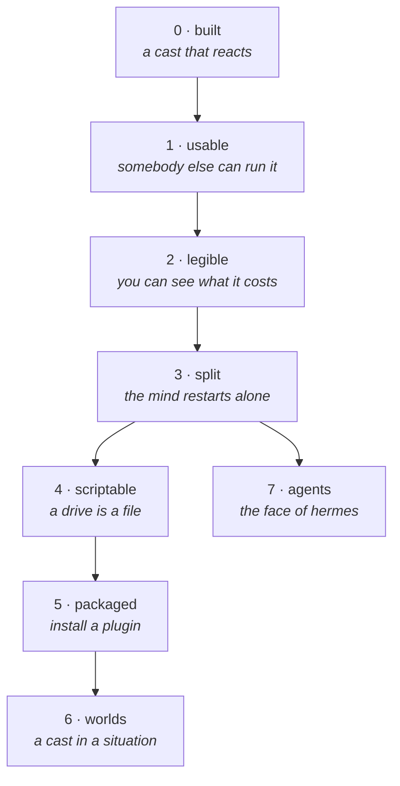

# Roadmap

Sequenced by **what you can see at the end of each phase**, not by subsystem. Every phase ends with
something demonstrable; anything that cannot be demonstrated is in the wrong phase.

Design law is [philosophy.md](philosophy.md). What exists today is
[architecture.md](architecture.md). Each phase links the design it implements.

---

## Phase 0 — built

Where it already is, for reference.

- Layer-shell overlay, wgpu renderer, SDF primitives, glyph atlas
- Graybox skin with a per-character palette; free-flight locomotion, no gravity
- Idle regiment and the reflex arc, each reflex recording itself
- Senses: foreign-toplevel, ext-workspace, idle-notify, MPRIS, inbox socket
- Attention gate — novelty, dwell, budget — and the quantiser
- Reactor: OpenAI-compatible client, auto-compacting context, five capabilities
- Layered prompt: `rules` · `awareness` · `self` · `persona`
- Voice as a command template; piper and espeak
- A roster of guys who witness each other
- `turns.jsonl` and `events.jsonl`; `--check`, `--print-config`, `--print-prompt`

---

## Phase 1 — usable by somebody who is not us

**Demo:** a person clones it, runs one command, answers three questions, and ends up with two
characters on their desktop that they can talk to.

| work | design | size |
|---|---|---|
| `lilguy doctor` — `--check` restructured, `--json`, one line per check | [lilguy-cli](todo/lilguy-cli.md) | 1 day |
| `lilguy start/stop/status` over the systemd unit | [lilguy-cli](todo/lilguy-cli.md) | half a day |
| `lilguy say "…"` over the inbox — also the test hook for everything after | [talking-to-him](todo/talking-to-him.md) | hours |
| `Observation::Told`, and a message closing the current slice immediately | [talking-to-him](todo/talking-to-him.md) | 1 day |
| Input surface: click him, type, Escape closes; reuses the bubble renderer | [talking-to-him](todo/talking-to-him.md) | 2 days |
| Per-guy voices — the field exists and is not read | [many-guys](todo/many-guys.md) | half a day |
| A shared floor on silence, so a cast is not a room that will not shut up | [many-guys](todo/many-guys.md) | half a day |
| `awareness` layer names the others; `speak` gains an optional `to` | [many-guys](todo/many-guys.md) | 1 day |
| `lilguy setup` — probe providers, probe **native tool calls**, pull a model, fetch a voice, install the unit | [lilguy-cli](todo/lilguy-cli.md) | 3 days |

**Why first:** everything else is worth more if somebody else can run it, and `lilguy say` unblocks
the message path that Phase 7 needs.

---

## Phase 2 — legible

**Demo:** `lilguy status` prints what each character has cost you today, and `doctor` prints what a
schedule will commit you to tomorrow.

| work | design | size |
|---|---|---|
| Extract the closed sets into one module; every string references it | [taxonomy-and-telemetry](todo/taxonomy-and-telemetry.md) | 1 day |
| `taxonomy` version, in `--check`, in frames, exposed to scripts | [taxonomy-and-telemetry](todo/taxonomy-and-telemetry.md) | hours |
| Tiers: `reflex` · `mind` · `might` · `bulk`, falling back **down, never up** | [model-tiers](todo/model-tiers.md) | 2 days |
| Engine-enforced `per_hour` / `per_day`; refusal as a value with a reason | [model-tiers](todo/model-tiers.md) | 1 day |
| Counters with `{tier, guy, plugin}` attribution, at the existing decision points | [taxonomy-and-telemetry](todo/taxonomy-and-telemetry.md) | 2 days |
| `state.json` snapshot; `lilguy status [--json]` | [taxonomy-and-telemetry](todo/taxonomy-and-telemetry.md) | 1 day |

**Why here:** tiers settle the vocabulary plugins are written against, and attribution has to exist
*before* there are plugins to attribute to, or it never gets retrofitted honestly.

---

## Phase 3 — split

**Demo:** `systemctl --user restart lilguys-soul` and the characters do not flicker.

| work | design | size |
|---|---|---|
| `lilguys-proto`: frame types, version on every frame, serde | [soul-hologram-split](todo/soul-hologram-split.md) | 1 day |
| Split the binary; hologram listens, everything else connects | [soul-hologram-split](todo/soul-hologram-split.md) | 3 days |
| ndjson over WebSocket, both directions | [soul-hologram-split](todo/soul-hologram-split.md) | 1 day |
| Bounded replay buffer, dropping oldest and **emitting a reflective record when it drops** | [soul-hologram-split](todo/soul-hologram-split.md) | 1 day |
| Two systemd units; soul wants hologram, is not required by it | [soul-hologram-split](todo/soul-hologram-split.md) | hours |
| A browser debug view — a static HTML file on the same socket | [soul-hologram-split](todo/soul-hologram-split.md) | 1 day |

**Acceptance:** soul absent is a supported state. Reflexes fire, feelings record, the cast is alive
and simply has nothing to reflect with.

---

## Phase 4 — scriptable

**Demo:** a feeding mechanic is a `.lua` file you drop in, and the character gets hungry.

| work | design | size |
|---|---|---|
| `mlua` with Luau; one host owning the VM, sandbox, interrupt, memory ceiling | [luau-scripting](todo/luau-scripting.md) | 3 days |
| `ctx`: `feel`, `state`, `config`, `log` — nothing else in the first cut | [luau-scripting](todo/luau-scripting.md) | 2 days |
| Stream API: `where` · `map` · `filter` · `dedupe` · `debounce` · `throttle` · `buffer` · `to` | [world-scripting](todo/world-scripting.md) | 3 days |
| `ctx.every`, then `ctx.cron` / `daily` / `weekly` with persisted last-run and catch-up | [world-scripting](todo/world-scripting.md) | 2 days |
| Reserved spend: sum the schedules, report against the tier budget | [model-tiers](todo/model-tiers.md) | 1 day |
| Per-script persistence, debounced | [luau-scripting](todo/luau-scripting.md) | 1 day |
| Rate limits on `ctx.feel`; cycle depth cap on streams | [world-scripting](todo/world-scripting.md) | 1 day |
| Ship `hunger.lua` as the worked example | [luau-scripting](todo/luau-scripting.md) | hours |

**Why after the split:** scripts are policy, they misbehave, and they belong on the side that can
be restarted without killing anyone.

---

## Phase 5 — packaged

**Demo:** `lilguy plugin install gh:someone/moth` and a different creature is on your desktop.

| work | design | size |
|---|---|---|
| Package layout; `lilguy plugin install/list/use/show` | [character-packages](todo/character-packages.md) | 3 days |
| Prompt layers from a plugin — with `rules` **not** overridable | [character-packages](todo/character-packages.md) | 1 day |
| Plugin identity, so telemetry attribution has a subject | [taxonomy-and-telemetry](todo/taxonomy-and-telemetry.md) | 1 day |
| Sprite adapter behind `Avatar`, reading Shimeji sets | [design-space §4](design-space.md) | 3 days |
| Live2D adapter — Cubism Native over FFI | [design-space §4](design-space.md) | 2 weeks |
| VRM adapter — glTF plus morph targets on wgpu | [design-space §4](design-space.md) | 2 weeks |
| Entities: spawn, draw, drag, drop, and the observations each produces | [character-packages](todo/character-packages.md) | 1 week |
| Context menus, hover, declarative entity reflexes | [character-packages](todo/character-packages.md) | 3 days |
| Pinned refs, and `lilguy plugin show` as a real audit against prompt injection | [lilguy-cli](todo/lilguy-cli.md) | 2 days |

**Acceptance:** play with a character for five minutes, then read `events.jsonl` — the session
should be legible from the log alone.

---

## Phase 6 — worlds

**Demo:** install one plugin, get seven characters and a situation that changes daily.

| work | design | size |
|---|---|---|
| Director as stream middleware: filter, rewrite, broadcast, address, author | [world-scripting](todo/world-scripting.md) | 1 week |
| `llm.ask(tier, …)` from Luau, over coroutines; nil on refusal | [world-scripting](todo/world-scripting.md) | 3 days |
| `llm.stream` as a sink that is also a source | [world-scripting](todo/world-scripting.md) | 2 days |
| `world.capability{…}` — per-character availability, schema cap, bounded `on_call` | [world-scripting](todo/world-scripting.md) | 1 week |
| Meaningful tool results, replacing the literal `"ok"` | [world-scripting](todo/world-scripting.md) | 1 day |
| A budget on authored events, so a director cannot narrate constantly | [world-scripting](todo/world-scripting.md) | 1 day |
| Ship a worked cast as the reference plugin | [world-scripting](todo/world-scripting.md) | 1 week |

**The law that governs the whole phase:** a world authors events and offers verbs. It never authors
a character's action. Philosophy rule 7.

---

## Phase 7 — agents

**Demo:** click a character, ask something, and the conversation continues in Telegram.

Can start once Phase 3 lands; the message path from Phase 1 is the other prerequisite.

| work | design | size |
|---|---|---|
| A minimal peer client as a worked example | [agent-integration](todo/agent-integration.md) | 2 days |
| hermes: a channel adapter for messages | [agent-integration](todo/agent-integration.md) | 3 days |
| hermes: an ambient plugin taking a digest **into memory, never a live context** | [agent-integration](todo/agent-integration.md) | 3 days |
| Routing: which messages go to the reactor and which to the agent | [agent-integration](todo/agent-integration.md) | 2 days |
| `lilguy integrate hermes` | [lilguy-cli](todo/lilguy-cli.md) | 1 day |

**The constraint that decides the design:** hermes treats per-conversation prompt caching as sacred.
Ambient observations go to memory, read at conversation start — never spliced into a running
context.

---

## Not scheduled

Deliberately, and each for its own reason.

- **[object-persistence](todo/object-persistence.md)** — an open question that may be answered by
  doing nothing. Collect the cases where a character wanted to refer to something and could not,
  before building an inventory that undoes the gate.
- **[three-process-split](todo/three-process-split.md)** — trigger-gated. Build it when identity
  outlives the model, or when somebody wants two minds on one soul.
- **Long-term memory** — a product question. It should emerge from finding out what a character
  needs to remember to be good company, not from deciding a vector store is required. The reactor's
  private notes are the seed and nothing yet reads them back.

## How to read the sizes

Days of focused work, not calendar time, and they are the optimistic number. The two-week entries —
Live2D and VRM — are the only ones where the risk is not in the design but in somebody else's SDK.
