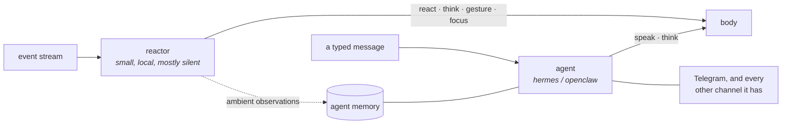

# Being the face of an agent

**Status:** not started, and the original reason this project exists.

lilguys was conceived as the topmost surface of an always-on agent — hermes, openclaw, or anything
else — so that a conversation begun by clicking a character on your desktop continues in Telegram,
and an agent that already knows your day gains a body. Everything built so far is the body. This is
the wiring.

## The agent is a channel, not the mind

The tempting shortcut is to let the agent *be* the mind: point the reactor at hermes and let it
answer slices. That is wrong, and the reason is cost shape.

The reactor answers a slice every forty-five seconds, and the correct answer is usually nothing. It
needs a small, cheap, local model that can shrug. An agent is the opposite: expensive, tool-bearing,
memory-carrying, and built to actually do things when addressed. Handing it a slice that says
"nothing happened" every minute is both wasteful and out of character — an agent's instinct is to
help, and there is nothing to help with.

So there are two different thinkers with two different jobs:

**The reactor owns reflex-level thought. The agent owns conversation.** A message routes to the
agent; ambient life routes to the reactor; both land on the same body.

## Two integrations, not one

They are genuinely separate pieces of work and should not be conflated.

### Ambient observations out

The agent learns what its person has been doing without anyone having a conversation about it. This
is a write-only path from the gate into the agent's memory.

The constraint that decides the design is hermes' own: **per-conversation prompt caching is
sacred**, and injecting "user is now watching X" into a live conversation invalidates it every few
minutes and multiplies cost. So ambient observations must go to *memory*, read at conversation
start or on explicit recall — never spliced into a running context.

That makes it a plugin on the agent side (`plugins/ambient/` in hermes' shape), fed by a slice
digest, not a channel adapter.

### Conversation in and out

A typed message goes to the agent as an ordinary message on a new channel. The reply comes back and
becomes `speak` and `think` calls on the body. Session continuity is the agent's problem, which is
the entire point — it already solves that for Telegram.

hermes has the shape for this already: a platform registry and a channel directory. The buddy is
one more platform.

## The protocol between them

Do not invent a third one. The soul↔hologram protocol
([soul-hologram-split.md](soul-hologram-split.md)) is ndjson over WebSocket carrying observations up
and intents down — which is exactly what an agent needs to speak to have a body.

**An agent is a peer that connects to the hologram and sends intents.** If that holds, integrating
any agent means implementing one small client, and lilguys needs no per-agent code at all. The
`lilguy` CLI ships the adapters ([lilguy-cli.md](lilguy-cli.md)); the daemon stays ignorant of who
is on the other end.

That also means an agent could replace the reactor entirely for someone who wants that, without a
flag or a fork.

## What must not break

- **No agent, no problem.** The body lives, the reactor thinks, nothing degrades. Same law as the
  mind (philosophy §2).
- **The agent obeys the same vetting.** An intent from hermes goes through `vet_speech` like any
  other. An agent is not more trusted than a model just because it is bigger.
- **Silence survives the introduction.** An agent that says something every time it is handed a
  slice ruins the character. Ambient observations go to memory; only messages get answers.

## Work

1. Land the soul/hologram protocol, since this rides on it.
2. `Observation::Told` and the message path ([talking-to-him.md](talking-to-him.md)).
3. A minimal peer client, as a worked example, in whatever language reads best.
4. hermes: a channel adapter for messages, an ambient plugin for the digest.
5. `lilguy integrate hermes` wiring both.

## Open questions

- Who decides whether a message goes to the reactor or the agent? Always the agent when one is
  attached is simplest. But a "what are you looking at" aimed at the *character* is not a question
  for a general assistant, and routing it away loses something.
- Does the agent see the ambient stream live, or only a digest at conversation start? Live is
  richer and fights prompt caching. Digest is cheaper and staler. Probably digest, with the live
  stream available to a plugin that asks.
