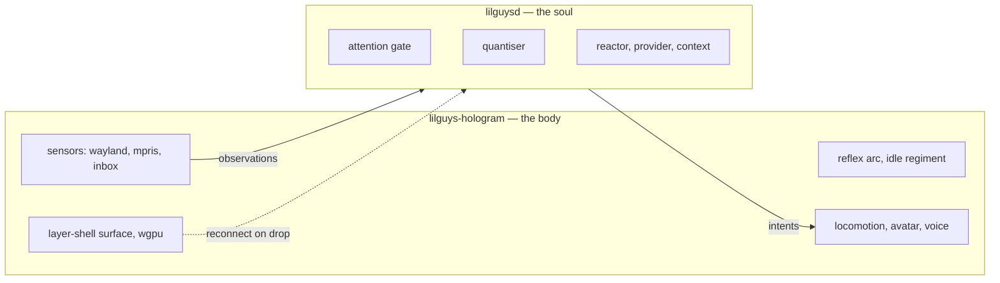

# Split the soul from the hologram

**Status:** not started. **Why:** the mind cannot be restarted without killing the character.

Today `lilguysd` is one process holding both the model loop and the Wayland surface. Restarting to
change a persona, a provider, or a gate rule tears down the layer surface and the buddy blinks out
of existence. That is wrong twice over: the philosophy says the body outlives the mind, and in
practice iteration on the soul is where all the work happens.

## Two processes, not three

Three roles are nameable and genuinely different — hologram, soul, mind — and they differ by
**restart cadence**, which is the test that earns a process boundary. But build two.

**Put the seam where three would cut.** The soul and the mind ship in one process, talking over an
in-process channel that carries the same frames a socket would. Promoting that channel to a second
socket later is a routing change, not a protocol change, and nothing above or below notices.

Two now, because a third process buys a shorter iteration loop and costs a second buffer, a second
handshake, a second failure mode and a second unit to supervise — and the loop is not the bottleneck
while this is a graybox. The case for three, and the triggers that make it worth doing, are in
[three-process-split.md](three-process-split.md).

## Buffering

The question that actually decides the shape, so it gets a rule rather than a case-by-case answer.

**The buffer lives on the side that cannot stop.** A downstream peer being absent is a normal
operating state; an upstream peer being absent is death. So each process buffers *for the thing
downstream of it*, never the other way round, and the hologram — which is never absent — is the
buffer of last resort.

Concretely, with two processes: the hologram buffers observations while the soul is away. With
three: the hologram buffers for the soul, and the soul buffers slices for the mind. The rule does
not change, only how many times it applies.

Three properties this needs:

1. **Buffer observations, not slices.** A restarted downstream must re-derive with its *current*
   policy. If the hologram buffered finished slices, a gate rule change could never apply to
   anything already queued — you would be replaying decisions made by the code you just replaced.
2. **Bounded by count, dropping oldest.** Bytes are the wrong unit; the thing being protected is
   the mind's ability to make sense of a window, and a window is a number of events.
3. **A drop is itself an event.** When the buffer sheds, the hologram emits a reflective record —
   `you lost track of a while there` — so the gap appears in the stream rather than silently
   deforming it. He is allowed to have missed something; he is not allowed to be unaware that he
   did. This follows from philosophy §"What this forbids" rule 5.

**Reflections are collected by whoever owns the gate.** Interoceptive records are produced in the
hologram — the reflex arc lives there, and it must work with nothing attached — and travel upstream
as ordinary observations. Nothing downstream distinguishes them from a window focus except by
reading the frame, which is the whole point of the single-stream decision.

## The two processes



**The hologram owns everything that must never stop:** the surface, every sensor, the reflex arc,
the idle regiment, locomotion, the avatar, the voice. It is the process that would be painful to
restart, so it is the one that never needs to be.

**The soul owns everything worth changing:** the gate, the quantiser, the reactor, the context
window, the prompt layers. Restarting it should cost a few seconds of not thinking, and nothing
else.

## What this must buy

1. **`systemctl --user restart lilguys-soul` and the character does not flicker.** The single
   acceptance test.
2. **Soul absent is a supported state, not an error.** The hologram runs indefinitely with no soul
   connected: reflexes fire, feelings record, the buddy is alive and simply has nothing to reflect
   with. This is already law (philosophy §2) — the split makes it testable.
3. **Observations survive a reconnect.** The hologram buffers while the soul is away and replays a
   bounded window on reconnect, so a restart loses thinking time rather than history.
4. **Version negotiation on connect.** A hologram and a soul from different builds either agree on
   a protocol version or refuse cleanly with a message naming both versions.

## Protocol

Start with the simplest thing that satisfies the four requirements above, and only reach for gRPC
if one of them demands it.

**Decided: newline-delimited JSON over a WebSocket.** It needs no code generation and no build-time
toolchain, and WebSocket buys two things a bare unix socket does not: a peer may live on another
machine, and a browser can attach to the same stream — a live debug view of observations and
intents becomes a static HTML file rather than a project. The ndjson framing on top is mildly
redundant with WebSocket's own framing and worth keeping anyway, because it means one parser serves
both a WebSocket peer and a unix-socket peer without a second code path.

| | ndjson over WebSocket | gRPC |
|---|---|---|
| schema | one versioned document, hand-written | `.proto`, generated |
| deps | none beyond serde | tonic, prost, build script |
| debugging | `websocat`, `jq`, or a browser tab | needs a client |
| streaming | trivial, one object per line | first-class |
| cross-language plugins | anything with an HTTP client | needs codegen |
| throughput | far past what is needed | far past what is needed |

The traffic is a few observations a minute and a handful of intents an hour. gRPC's advantages do
not engage at that volume, and its costs are permanent.

### Frames

Two directions, one object per line, every frame tagged.

```jsonc
// hologram → soul
{"v":1,"t":"hello","hologram":"0.2.0","skin":"graybox","capabilities":["react","gesture","speak","focus"]}
{"v":1,"t":"observation","at":1787164892.67,"kind":"focus","summary":"focus zen — a video essay","payload":{}}
{"v":1,"t":"state","present":true,"workspace":"2","focused":"zen — a video essay","sensation":"drifting, feeling curious 40%"}

// soul → hologram
{"v":1,"t":"hello","soul":"0.2.0","protocol":1}
{"v":1,"t":"intent","intent":"react","args":{"emotion":"curious","intensity":0.6,"hold":8}}
{"v":1,"t":"intent","intent":"focus","args":{"target":"window","match":"zen","linger":30}}
```

`v` is the protocol version and it is on every frame, not only the handshake, so a mismatch is
caught at the frame that breaks rather than at connect time. The `capabilities` list in the
hologram's hello is what lets a newer soul discover it must not send a `gesture` an older hologram
cannot draw.

**The gate moves to the soul.** It is policy, and policy belongs with the thing being iterated on.
The hologram sends every observation and lets the soul discard. At this volume the socket cost is
irrelevant, and it keeps the hologram free of anything worth tuning.

**The reflex arc stays in the hologram**, because it must work with no soul attached. That means
the observation-to-expression mapping is duplicated in spirit — the hologram reacts, the soul
learns that it did. That is not duplication, that is the two-speed response.

## Work

1. Extract the protocol into `lilguys-proto` — frame types, version constant, serde derives. No
   behaviour.
2. Split the binary: `lilguys-hologram` keeps `app`, `avatar`, `locomotion`, `sensors`, `voice`,
   `gpu`, `hypr`. `lilguysd` keeps `attention`, `mind`, `config`'s prompt and provider halves.
3. The **hologram listens**, everything else connects — so restarting anything upstream of the body
   is the ordinary case and needs no retry logic in the process that must never stop.
4. Bounded replay buffer in the hologram, sized in observations not bytes, dropping oldest, and
   emitting a reflective record when it drops. See "Buffering" above.
5. Two systemd user units, the soul wanting the hologram but not required by it.
6. Extend `--check` to report the protocol version and whether a peer is attached.

## Open questions

- Does the voice belong to the hologram or the soul? Currently the hologram, because the mouth
  moves with it. But a soul that streams audio would want to own synthesis. Leaving it in the
  hologram until something forces the question.
- Should the config be split too, or stay one file both processes read? One file is friendlier;
  two processes reading one file makes reload semantics muddier. Probably one file, each reading
  the sections it owns.
