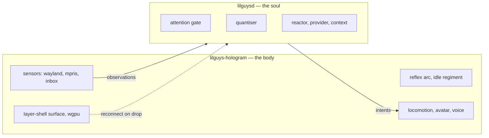

# Split the soul from the hologram

**Status:** not started. **Why:** the mind cannot be restarted without killing the character.

Today `lilguysd` is one process holding both the model loop and the Wayland surface. Restarting to
change a persona, a provider, or a gate rule tears down the layer surface and the buddy blinks out
of existence. That is wrong twice over: the philosophy says the body outlives the mind, and in
practice iteration on the soul is where all the work happens.

## The two processes



**The hologram owns everything that must never stop:** the surface, every sensor, the reflex arc,
the idle regiment, locomotion, the avatar, the voice. It is the process that would be painful to
restart, so it is the one that never needs to be.

**The soul owns everything worth changing:** the gate, the quantiser, the reactor, the context
window, the prompt layers. Restarting it should cost a few seconds of not thinking, and nothing
else.

## What this must buy

1. **`systemctl --user restart lilguys-soul` and the character does not flicker.** The single
   acceptance test.
2. **Soul absent is a supported state, not an error.** The hologram runs indefinitely with no soul
   connected: reflexes fire, feelings record, the buddy is alive and simply has nothing to reflect
   with. This is already law (philosophy §2) — the split makes it testable.
3. **Observations survive a reconnect.** The hologram buffers while the soul is away and replays a
   bounded window on reconnect, so a restart loses thinking time rather than history.
4. **Version negotiation on connect.** A hologram and a soul from different builds either agree on
   a protocol version or refuse cleanly with a message naming both versions.

## Protocol

Start with the simplest thing that satisfies the four requirements above, and only reach for gRPC
if one of them demands it.

**Recommended: newline-delimited JSON over a unix socket**, the same shape as the inbox that
already exists. It needs no code generation, no build-time toolchain, no runtime, and it is
debuggable with `socat` and `jq` — which matters more than throughput at ten messages a minute.

| | ndjson over unix socket | gRPC |
|---|---|---|
| schema | one versioned document, hand-written | `.proto`, generated |
| deps | none beyond serde | tonic, prost, build script |
| debugging | `socat` and `jq` | needs a client |
| streaming | trivial, one object per line | first-class |
| cross-language plugins | anything | needs codegen |
| throughput | far past what is needed | far past what is needed |

The traffic is a few observations a minute and a handful of intents an hour. gRPC's advantages do
not engage at that volume, and its costs are permanent. **Choose ndjson unless a soul is expected
to live on another machine**, where gRPC's transport story starts earning its weight.

### Frames

Two directions, one object per line, every frame tagged.

```jsonc
// hologram → soul
{"v":1,"t":"hello","hologram":"0.2.0","skin":"graybox","capabilities":["react","gesture","speak","focus"]}
{"v":1,"t":"observation","at":1787164892.67,"kind":"focus","summary":"focus zen — a video essay","payload":{}}
{"v":1,"t":"state","present":true,"workspace":"2","focused":"zen — a video essay","sensation":"drifting, feeling curious 40%"}

// soul → hologram
{"v":1,"t":"hello","soul":"0.2.0","protocol":1}
{"v":1,"t":"intent","intent":"react","args":{"emotion":"curious","intensity":0.6,"hold":8}}
{"v":1,"t":"intent","intent":"focus","args":{"target":"window","match":"zen","linger":30}}
```

`v` is the protocol version and it is on every frame, not only the handshake, so a mismatch is
caught at the frame that breaks rather than at connect time. The `capabilities` list in the
hologram's hello is what lets a newer soul discover it must not send a `gesture` an older hologram
cannot draw.

**The gate moves to the soul.** It is policy, and policy belongs with the thing being iterated on.
The hologram sends every observation and lets the soul discard. At this volume the socket cost is
irrelevant, and it keeps the hologram free of anything worth tuning.

**The reflex arc stays in the hologram**, because it must work with no soul attached. That means
the observation-to-expression mapping is duplicated in spirit — the hologram reacts, the soul
learns that it did. That is not duplication, that is the two-speed response.

## Work

1. Extract the protocol into `lilguys-proto` — frame types, version constant, serde derives. No
   behaviour.
2. Split the binary: `lilguys-hologram` keeps `app`, `avatar`, `locomotion`, `sensors`, `voice`,
   `gpu`, `hypr`. `lilguysd` keeps `attention`, `mind`, `config`'s prompt and provider halves.
3. Socket at `$XDG_RUNTIME_DIR/lilguys-soul.sock`. The **hologram listens**, the soul connects —
   so restarting the soul is the ordinary case and needs no retry logic in the hologram.
4. Bounded replay buffer in the hologram, sized in observations not bytes, dropping oldest.
5. Two systemd user units, the soul wanting the hologram but not required by it.
6. Extend `--check` to report the protocol version and whether a peer is attached.

## Open questions

- Does the voice belong to the hologram or the soul? Currently the hologram, because the mouth
  moves with it. But a soul that streams audio would want to own synthesis. Leaving it in the
  hologram until something forces the question.
- Should the config be split too, or stay one file both processes read? One file is friendlier;
  two processes reading one file makes reload semantics muddier. Probably one file, each reading
  the sections it owns.
