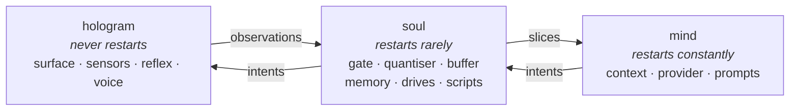

# Split the mind out of the soul

**Status:** not started, and deliberately not soon. **Depends on:**
[soul-hologram-split.md](soul-hologram-split.md).

The two-process split gives a body that never stops and a soul that can be restarted. This is the
one after it: pulling the **mind** out of the soul, so the part you iterate on constantly becomes
the part that is cheapest to throw away.

Do not build this until one of the triggers below is actually true. It is recorded here so that
when one fires, the reasoning is not re-derived from scratch.

## The three roles

The seam is **restart cadence**, and the three sides differ by orders of magnitude:

| | restarting costs | how often you touch it |
|---|---|---|
| hologram | the character blinks out | never |
| soul | pending dwells, dedup tables | rarely — a gate rule |
| mind | conversation history | constantly — a persona, a model |

**Identity moves to the soul. The mind becomes disposable.** That inversion is the whole point: the
thing holding who he is stops being the thing you restart to change what he sounds like.

## Triggers

Build it when one of these is true, not before.

1. **Identity outlives the model.** Once the soul holds memory, drives and Luau scripts, restarting
   it means forgetting. At that point the current arrangement has it backwards — the forgetful
   process is the one you touch most.
2. **Several minds at once.** A cheap local model for most slices and a large hosted one for the
   rare interesting slice is two connections to one soul. Two processes cannot express it; three
   express it as routing.
3. **The soul outlives the session.** Continuity across hologram lifetimes — he remembers yesterday
   even though the surface died with your session — is a different lifecycle from a mind.
4. **The prompt loop gets tight enough to matter.** If iterating on prompt layers becomes the
   dominant activity, shaving a soul restart off each cycle starts paying for the complexity.

## What actually changes

Very little, if the two-process split is done as designed.

- **The frames are already right.** Observations up, intents down, versioned, at both seams. The
  soul→mind channel carries slices instead of raw observations, which is one more frame type.
- **The in-process channel becomes a socket.** The two-process build already routes soul→mind over
  a channel carrying socket-shaped frames, so this is a transport swap.
- **The buffering rule does not change.** Each side buffers for the thing downstream of it. The
  hologram buffers for the soul; the soul buffers slices for the mind. One rule, applied twice.
- **A third systemd unit**, wanting the soul, not required by it.

## What must not change

- **The reflex arc stays in the hologram.** It must work with neither soul nor mind attached.
- **The gate stays in the soul.** It is what makes silence cheap, and it must keep discarding while
  the mind is down.
- **Interoception stays single-stream.** A slice sent to the mind carries feelings and desktop
  events as neighbours, exactly as now. Three processes must not become an excuse for a privileged
  channel — see [philosophy.md](philosophy.md).

## Open question

Where does context compaction live? It is the mind's data but the soul's concern — a mind restarted
mid-conversation either reloads a context the soul persisted, or starts cold and loses continuity
the soul was supposed to own. Leaning towards the soul persisting the compacted summary and handing
it to a mind on connect, which makes the mind genuinely stateless. That is a bigger change than the
transport swap and is the real work in this item.
