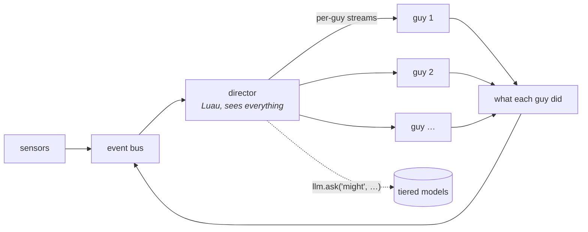

# A thin core and a scripted world

**Status:** not started. **Depends on:** [luau-scripting.md](luau-scripting.md),
[model-tiers.md](model-tiers.md), [many-guys.md](many-guys.md).

The roster proves that several characters can share a desktop and see each other. What it does not
give you is a *situation*: nothing decides that today is the day the Krusty Krab runs out of
patties. Weather, plot, locations, arcs — none of that comes from a Wayland sensor, because none of
it is true. It has to be authored.

The proposal is that authoring lives in Luau, not in Rust, and that a single installable plugin can
carry an entire cast plus the machinery that runs them.

## Where the line goes

The Rust core keeps what is irreducible: the things that must be fast, must be safe, or must work
when everything above them is broken.

| Rust keeps | because |
|---|---|
| surface, renderer, avatar adapters | 60 Hz, GPU, and a crash here is a dead character |
| sensors | protocol and D-Bus plumbing, shared by everyone |
| body physics and the reflex arc | must work with no soul, no script, no model |
| the event vocabulary | it is the contract; if scripts could extend it nothing would compose |
| provider client, tiers, budgets | the thing spending money cannot be the thing policing it |
| the Luau host, its sandbox and interrupts | a script cannot be trusted to bound itself |

Everything else can be script: gate policy, prompt composition, who is where, what is happening
today, and what any of it means.

## The director

A world script is not a fifth guy. It sits **between the bus and the roster** as middleware on the
stream:



It sees every observation from every source and every action every character takes. It may:

- **filter** — this guy is asleep, he hears nothing
- **rewrite** — Patrick hears "Krabby Patty" as "Krabby Patty!!!"
- **broadcast** — everyone learns the lights went out
- **address** — only Squidward learns his clarinet is missing
- **author** — invent events no sensor produced, on its own clock
- **ask a model** — spend a `might` call to plan an arc, then dribble it out as events over an hour

That last one is the point. An episode generator is a script that occasionally spends one expensive
call to decide what today is about, and then spends the next hour turning that into cheap ambient
events which the characters react to in their own voices.

## The boundary that keeps this from collapsing

**A director injects events. It never injects intents.**

If a script could make SpongeBob say a line, the characters stop being characters and become
puppets reading a screenplay, and every claim in [philosophy.md](../philosophy.md) about minds and
bodies becomes decoration. The whole value of a cast is that you do not know what they will say.

So the strongest thing a director may do is make something *true* for a character:

```lua
world.tell("SpongeBob", {
  state = "smell something burning",
  detail = "it is coming from the grill",
  tone = "surprised", intensity = 0.8,
})
```

That is a very strong nudge and still leaves him free to ignore it, misread it, or say something
nobody planned. Which is the entire reason to run seven language models instead of writing dialogue.

The same rule stated as law: **the director authors the world, the characters author themselves.**

## What a plugin carries

```
bikini-bottom/
  plugin.toml            what it is, which tiers it wants, what it degrades to
  characters/
    spongebob.toml       persona, palette, voice
    patrick.toml
    squidward.toml       … and four more
  world/
    episode.lua          spends `might` once an hour to decide what today is
    locations.lua        who is where, and what that means for who hears what
    weather.lua          ambient, cheap, no model at all
  avatar/
    …
```

One install, seven personalities, three world scripts. The person configures which tiers exist and
what they can afford; the plugin adapts. On a machine with only a local 4B, `might` resolves down
to `mind` and the episode generator runs a dumber arc — it does not fail to run.

## Why this is the right shape

Every large feature discussed so far — drives, entities, locations, plot, moods, weather — is the
same shape: **something authors an event, a character reacts to it in character.** Building each as
Rust would give seven subsystems that do not compose. Building the injection point once, in the
core, and everything above it as script gives one subsystem that composes with itself.

It also moves the interesting work to where iteration is cheap. Changing how an episode is
structured should not be a `cargo build`.

## What has to exist first

1. **Tiers** ([model-tiers.md](model-tiers.md)) — a script cannot call a model portably without
   them.
2. **The Luau host** ([luau-scripting.md](luau-scripting.md)) — sandbox, interrupts, memory ceiling.
   A director runs on every event from every guy, so its cost ceiling matters more than a drive's.
3. **The soul/hologram split** ([soul-hologram-split.md](soul-hologram-split.md)) — a director is
   policy and belongs on the restartable side. Editing an episode script must not blink the cast
   out of existence.
4. **`llm.ask(tier, prompt, opts)`** returning nil when refused, with the refusal logged.

## Open questions

- **One director, or a chain?** A chain composes (weather, then locations, then episode) and makes
  ordering a config concern. One is simpler and pushes composition into the script's own hands.
  Leaning chain, because that is how the plugin above is naturally written.
- **Can a director see a guy's *thoughts*, or only their actions?** Thoughts are already broadcast
  as observations to the other guys, so the director sees them too. That may be too much power —
  it can read the room's inner monologue and plan against it, which is either wonderful or cheating.
- **What stops an episode script from narrating?** Nothing structural. A world that constantly
  announces itself is as annoying as a character that does. The gate protects characters from the
  desktop; nothing yet protects characters from an over-eager director. Probably the same shape of
  answer: a budget on authored events, and silence as the default.
- **Does the director need its own memory?** An arc spanning hours needs state across restarts.
  Script persistence covers it, but an arc is a bigger thing than a hunger counter and may want
  something better than a JSON blob.
