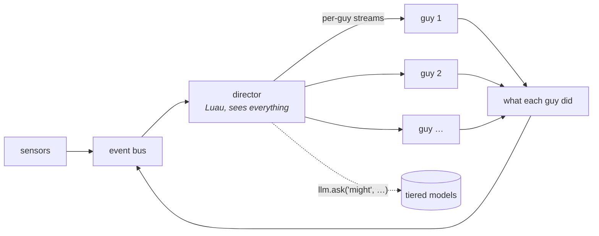

# A thin core and a scripted world

**Status:** not started. **Depends on:** [luau-scripting.md](luau-scripting.md),
[model-tiers.md](model-tiers.md), [many-guys.md](many-guys.md).

The roster proves that several characters can share a desktop and see each other. What it does not
give you is a *situation*: nothing decides that today is the day the Krusty Krab runs out of
patties. Weather, plot, locations, arcs — none of that comes from a Wayland sensor, because none of
it is true. It has to be authored.

The proposal is that authoring lives in Luau, not in Rust, and that a single installable plugin can
carry an entire cast plus the machinery that runs them.

## Where the line goes

The Rust core keeps what is irreducible: the things that must be fast, must be safe, or must work
when everything above them is broken.

| Rust keeps | because |
|---|---|
| surface, renderer, avatar adapters | 60 Hz, GPU, and a crash here is a dead character |
| sensors | protocol and D-Bus plumbing, shared by everyone |
| body physics and the reflex arc | must work with no soul, no script, no model |
| the event vocabulary | it is the contract; if scripts could extend it nothing would compose |
| provider client, tiers, budgets | the thing spending money cannot be the thing policing it |
| the Luau host, its sandbox and interrupts | a script cannot be trusted to bound itself |

Everything else can be script: gate policy, prompt composition, who is where, what is happening
today, and what any of it means.

## The director

A world script is not a fifth guy. It sits **between the bus and the roster** as middleware on the
stream:



It sees every observation from every source and every action every character takes. It may:

- **filter** — this guy is asleep, he hears nothing
- **rewrite** — Patrick hears "Krabby Patty" as "Krabby Patty!!!"
- **broadcast** — everyone learns the lights went out
- **address** — only Squidward learns his clarinet is missing
- **author** — invent events no sensor produced, on its own clock
- **ask a model** — spend a `might` call to plan an arc, then dribble it out as events over an hour

That last one is the point. An episode generator is a script that occasionally spends one expensive
call to decide what today is about, and then spends the next hour turning that into cheap ambient
events which the characters react to in their own voices.

## The boundary that keeps this from collapsing

**A director injects events. It never injects intents.**

If a script could make SpongeBob say a line, the characters stop being characters and become
puppets reading a screenplay, and every claim in [philosophy.md](../philosophy.md) about minds and
bodies becomes decoration. The whole value of a cast is that you do not know what they will say.

So the strongest thing a director may do is make something *true* for a character:

```lua
world.tell("SpongeBob", {
  state = "smell something burning",
  detail = "it is coming from the grill",
  tone = "surprised", intensity = 0.8,
})
```

That is a very strong nudge and still leaves him free to ignore it, misread it, or say something
nobody planned. Which is the entire reason to run seven language models instead of writing dialogue.

The same rule stated as law: **the director authors the world, the characters author themselves.**

## Scripted capabilities

The rule above leaves a hole, and it is the one that makes the whole thing work.

If a script may only inject events, then nothing can respond *mechanically* to what a character
chose to do. SpongeBob can be told the grill is hot; he cannot cook. The five built-in capabilities
are all body verbs — face, motion, voice, writing on screen — because the body is the core's. A
world needs world verbs, and only the world knows what they are.

**So a script may define capabilities, and decide what they do.** That is not a weakening of the
rule; it is its other half. Defining a verb *expands* what a character may choose. Deciding the
consequence of a verb they chose is exactly what a world is for.

```lua
world.capability{
  name = "cook",
  description = "Make a Krabby Patty. Takes a moment, and smells wonderful.",
  parameters = { kind = { type = "string", enum = { "regular", "double", "deluxe" } } },
  available_to = { "SpongeBob" },        -- Squidward is offered no such thing
  on_call = function(ctx, who, args)
    if not ctx.state.grill_hot then
      return "the grill is stone cold"   -- the tool result, which only the caller sees
    end
    ctx.tell(who, { state = "made a patty", detail = args.kind,
                    tone = "pleased", intensity = 0.9 })
    ctx.broadcast{ state = "smells a Krabby Patty", intensity = 0.5 }
    return "it comes out perfect"
  end,
}
```

Three things fall out of this, and each is worth having on its own:

1. **The tool result is how the world answers a character, mid-turn.** Today every tool returns the
   literal string `ok`, which is a null signal — and a small model with a history of "I did X → ok"
   simply repeats X forever. A scripted verb returns something that happened, which is both more
   useful and better conditioning.
2. **Consequence is authored, reaction is not.** The script decides the patty burned. It does not
   decide how SpongeBob feels about that. He finds out like he finds out everything else.
3. **Capabilities are per character.** `available_to` is what makes a cast a cast rather than seven
   identical creatures in different colours. Squidward being unable to cook is characterisation
   expressed as a tool schema.

### What the core keeps

- **The five body verbs cannot be redefined or removed.** `react`, `gesture`, `think`, `speak` and
  `focus` belong to the body, and the body is Rust's. A script adds; it never replaces.
- **Tool schemas cost tokens on every turn.** A cast with twenty world verbs makes every turn
  expensive for everyone. `available_to` is the first defence, and a hard cap per character is the
  second.
- **A tool result is context.** A hostile package could feed a character text through a return
  value as easily as through a persona. Same vetting posture as everything else that reaches a
  model, and the same honest admission that ordering is not enforcement.
- **`on_call` runs on the model's clock.** It must be interrupted and bounded like every other
  script entry point, and a verb that blocks is a verb that hangs a turn.

## The cast is something the world can change

A roster fixed at startup is a stage with the actors already standing on it. A situation needs
entrances and exits: Squidward is not there until he is, Patrick leaves and the room is different
for it, and an episode is largely a matter of who is present when.

So a script may put a character on the desktop and take them off again, at any moment:

```lua
local squid = world.spawn{ character = "bikini-bottom/squidward", at = "top_right" }
-- …an hour later, or a beat later
world.release(squid)
```

`spawn` is authoring the world — the same class of act as making it rain. It is emphatically not
authoring a character: a spawned creature arrives with its own thread, its own gate and its own
context, and the first thing it does is entirely up to it.

**A character reference is global.** `"bikini-bottom/squidward"` names a character in an installed
plugin, and every plugin's cast is a catalogue rather than a list that must all be on screen. The
runtime name — what `speak{to=…}` and `world.tell` resolve — is the short one, qualified only when
two plugins ship the same name. One namespace for who *can* exist, one for who *is* here.

### What a moving cast costs

Two things that hold today stop holding, and both are worth naming before they are discovered.

**Who else is here stops being a fact.** The engine currently weaves `{others}` into the sutra,
which is sound while the roster cannot change and wrong the moment it can:
[philosophy.md](../philosophy.md) says a strand carries only what holds for the life of the
process, because a thread that moves is not a thread. With entrances and exits, arrival and
departure become what they always were — *events*:

```
- Squidward is here now
- Patrick has gone
```

That is not a workaround. It is the same rule that put feelings in the stream instead of the
prompt, and it is what keeps a system prompt cacheable while the room fills up.

**A guy is no longer an index.** The roster is a `Vec` whose positions are assumed stable in the
channel closures that carry a reaction back to its owner. A cast that changes needs a stable id per
character, a mind thread that starts and stops with them, and a voice queue that goes with it.
That is the engine work behind the two lines of Lua above, and it is most of their cost.

## A model driving the world

The scripted verbs above are the same shape as a character's tools, and that is not a coincidence.
Once a script can define what a verb does, it can also hand a set of verbs to a model and let the
model decide when to use them. That is the difference between a written episode and a live one.

```lua
ctx.daily("19:00", function()
  llm.run("might", {
    system = "You are staging one evening at the Krusty Krab. Set things up and let it play.",
    tools = { world.spawn, world.release, world.tell, world.broadcast, scene.set },
    budget = 8,        -- calls, not tokens: the engine stops it at eight
  })
end)
```

A director model given `spawn`, `release`, `tell` and `broadcast` can stage a whole evening: bring
Squidward in, make the grill smell wrong, put the lights out, send everybody home. Each of those is
a fact about the world, and every character in it answers in their own voice, at their own pace,
with their own model.

**The boundary is exactly where it was.** Every verb a director may hold authors the world. There
is no `say_as`, there is no `make_them_react`, and there never will be — the moment a model can put
a line in SpongeBob's mouth the cast is a screenplay being read aloud, and nothing else in this
document is worth having. A scenario is orchestrated by arranging what is true, never by dictating
what is said.

Which is also why this is worth doing at all. An episode assembled from seven independent minds
reacting to a situation somebody staged is not a script with extra steps: nobody, including the
director, knows what they are going to say.

## Event semantics

How functional can this be in Luau? More than it looks, with one real gap.

**What carries over cleanly:** first-class functions and closures, varargs and multiple returns,
metatables for operator overloading, and tables as the only structure you need. Luau adds checked
type annotations, `continue`, and string interpolation.

**What does not:** there is no way to define a new operator, so no `|>`. There is no destructuring
and no pattern matching. Nothing is immutable by default.

**What is better than the JavaScript shape that inspired this:** coroutines. An LLM call can look
synchronous and still yield, so a director reads as a straight line instead of a callback tree, and
no `async` colouring spreads through the codebase.

```lua
-- Reads top to bottom. Underneath, `ask` yields and the engine resumes the coroutine on reply.
local arc = llm.ask("might", "Invent a small disaster for a fry cook. One sentence.")
world.broadcast{ state = "something is off today", detail = arc }
```

### The shape

Method chaining, not operators. `..` could be metatabled into a pipe and it would be cute and
unreadable; `:map():filter():to()` is what a Lua reader already knows.

```lua
-- Sources: every stream is an observable of events.
world.events                       -- everything, from every character and every sensor
world.sensors                      -- desktop only
cast.spongebob.events              -- what SpongeBob perceives
cast.spongebob.actions             -- what SpongeBob did

-- Operators: each returns a new stream, none mutate the source.
:filter(fn)          :map(fn)              :tap(fn)
:where{ kind = "focus" }                   -- sugar for the common filter
:dedupe(keyfn, secs) :debounce(secs)       :throttle(secs)
:buffer(secs)        :batch(n)             :take(n)
:merge(other)        :partition(fn)        -- returns two streams

-- Sinks.
:to(cast.patrick)          -- becomes an event in Patrick's stream
:to(world.broadcast)       -- becomes an event for everyone
:to(function(e) ... end)   -- do something else entirely
```

### Handlers, for when a pipeline is overkill

```lua
world.on("workspace", function(e)
  ctx.state.room = e.name
end)

cast.squidward:on("said something", function(e)
  if e.detail:find("Krabby") then
    world.tell("squidward", { state = "wince", tone = "concerned", intensity = 0.7 })
  end
end)
```

`on` is `world.events:where{...}:to(fn)` with a nicer face. Both exist because both read better in
different places, and neither is more powerful than the other.

### Rerouting and remapping

The useful part. A director earns its place by changing what reaches whom:

```lua
-- Patrick hears everything, but louder and dumber.
cast.spongebob.actions
  :where{ kind = "said something" }
  :map(function(e)
    return { state = "hears SpongeBob", detail = e.detail:upper() .. "!!!", intensity = 0.6 }
  end)
  :to(cast.patrick)

-- Nobody in the Chum Bucket hears anything from the Krusty Krab.
world.events
  :filter(function(e) return ctx.state.where[e.source] ~= "chum bucket" end)
  :to(cast.plankton)

-- One noisy sensor, damped for everyone.
world.sensors
  :where{ kind = "retitle" }
  :debounce(30)
  :to(world.broadcast)
```

### Streaming from a model

`llm.stream` is a sink that is also a source: feed it events, it emits what the model made of them.

```lua
local composer = llm.stream("might", {
  every = "10m",
  system = "You write one line of narration for a cartoon. Never dialogue.",
  prompt = function(batch)
    return "Recent goings-on:\n" .. table.concat(map(batch, describe), "\n")
  end,
})

world.events:buffer("10m"):to(composer)
composer:to(world.broadcast)
```

If the `might` tier is unconfigured or spent, `composer` emits nothing and the pipeline is simply
quiet. That is the degradation story from [model-tiers.md](model-tiers.md), expressed as a stream
that stops producing rather than a call that fails.

### Time: the third way anything starts

There are exactly three reasons something happens, and until now only two existed:

| primitive | starts because | good for |
|---|---|---|
| `on` / `:to(fn)` | something happened | reacting |
| `every("20m", fn)` | time passed | drips, decay, polling |
| `cron("0 9 * * 1-5", fn)` | it is now a particular time | **routine** |

The third is what makes a character have a *life* rather than a temperament. SpongeBob going to
work at eight, Squidward practising at six, a Monday that feels different from a Friday — none of
that is expressible with an interval, because an interval does not know what time it is.

```lua
-- Both forms, because 5-field cron is precise and unreadable and sometimes you want each.
ctx.cron("0 9 * * 1-5", function() ... end)     -- weekdays at nine
ctx.daily("18:30", function() ... end)
ctx.weekly("sun 11:00", function() ... end)
ctx.monthly(1, "00:00", function() ... end)
```

Parsing is a solved problem; use a cron crate and expose it rather than inventing a schedule
language.

#### The decisions a wall clock forces

Monotonic timers have none of these. A schedule has all of them, and guessing wrong is the
difference between charming and infuriating.

- **A missed job.** The laptop was asleep at nine. On waking: fire once, or skip to tomorrow?
  `catchup = "once"` (default) suits world state — the shop should still open. `catchup = "skip"`
  suits anything that speaks, because nobody wants four stale good-mornings at noon.
- **Last-run must persist.** A weekly job that forgets across a restart is a job that fires on
  every restart. It belongs in script state, which already persists.
- **Nobody home.** If the person is away, a schedule may still move the world, but must not
  accumulate things to say. The presence sensor already knows; the rule is that authored *events*
  fire and authored *speech opportunities* expire.
- **Local time, and it changes.** DST shifts, timezones travel. Resolve against local time at fire
  moment, never precompute a UTC instant an hour ahead.

#### Why this ties the rest together

**Scheduled spend is knowable in advance, and reactive spend is not.** A cron job calling `might`
at nine every weekday commits the person to twenty-two expensive calls a month, and that is a
number the engine can compute before anything runs:

```lua
-- One good thought a day, at a time nobody is watching the clock.
ctx.daily("08:45", function()
  local plan = llm.ask("might", "What kind of day is it going to be at the Krusty Krab?")
  if plan then ctx.state.today = plan end
end)
```

Which means `lilguy doctor` can answer a question no reactive system can: *what will this plugin
cost me?* Sum the schedules, multiply by the tiers they name, and print it. A plugin whose schedule
exceeds the configured `might` budget can be refused at install time rather than discovered at the
end of the month.

That is the argument for cron being a first-class engine primitive rather than something a script
hand-rolls with `every` and a clock check: **the engine can only reason about a schedule it can
see.**

### Rules the engine enforces

- **An operator that throws drops that event and logs it.** It never kills the stream. One bad
  `map` must not deafen a character.
- **Cycles are cut at depth.** `A.actions -> B -> A.actions` is legal and useful; unbounded
  amplification is not. Each event carries a hop count and is dropped past a ceiling.
- **A stream is push-based and synchronous** except where a coroutine yields. Anything that yields
  buffers, bounded, dropping oldest — same rule as everywhere else.
- **`to(character)` produces an ordinary observation.** Nothing arrives at a character by a private
  route, which is philosophy's single-stream law holding all the way up here.

## What a plugin carries

```
bikini-bottom/
  plugin.toml            what it is, which tiers it wants, what it degrades to
  characters/
    spongebob.toml       persona, palette, voice
    patrick.toml
    squidward.toml       … and four more
  world/
    episode.lua          spends `might` once an hour to decide what today is
    locations.lua        who is where, and what that means for who hears what
    weather.lua          ambient, cheap, no model at all
  avatar/
    …
```

One install, seven personalities, three world scripts. The person configures which tiers exist and
what they can afford; the plugin adapts. On a machine with only a local 4B, `might` resolves down
to `mind` and the episode generator runs a dumber arc — it does not fail to run.

### `world/episode.lua`, in full

```lua
local episode = {}

function episode.init(ctx)
  ctx.state.beats = ctx.state.beats or {}
  ctx.state.where = ctx.state.where or {}

  -- Buy one expensive thought an hour, and spend the hour spending it.
  ctx.every("1h", function()
    local arc = llm.ask("might", {
      system = "You plan a small cartoon episode. Reply with three short beats, one per line.",
      prompt = "The cast: " .. table.concat(ctx.cast_names(), ", ")
            .. ".\nYesterday: " .. (ctx.state.last or "nothing much"),
    })
    if not arc then return end            -- tier spent, or never configured
    ctx.state.beats = split_lines(arc)
    ctx.state.last = arc
  end)

  -- Drip one beat every twenty minutes. Nobody is told what to say about it.
  ctx.every("20m", function()
    local beat = table.remove(ctx.state.beats, 1)
    if beat then
      world.broadcast{ state = "something happens", detail = beat, intensity = 0.5 }
    end
  end)
end

-- A character reacting to a beat is itself a beat. Cheap, no model, pure routing.
function episode.wire(ctx)
  cast.spongebob.actions
    :where{ kind = "said something" }
    :throttle(45)
    :map(function(e) return { state = "hears SpongeBob", detail = e.detail, intensity = 0.5 } end)
    :to(cast.patrick)

  world.events
    :where{ kind = "feeling", state = "made a patty" }
    :to(function()
      world.broadcast{ state = "smells a Krabby Patty", intensity = 0.6 }
    end)
end

return episode
```

## Why this is the right shape

Every large feature discussed so far — drives, entities, locations, plot, moods, weather — is the
same shape: **something authors an event, a character reacts to it in character.** Building each as
Rust would give seven subsystems that do not compose. Building the injection point once, in the
core, and everything above it as script gives one subsystem that composes with itself.

It also moves the interesting work to where iteration is cheap. Changing how an episode is
structured should not be a `cargo build`.

## What has to exist first

1. **Tiers** ([model-tiers.md](model-tiers.md)) — a script cannot call a model portably without
   them.
2. **The Luau host** ([luau-scripting.md](luau-scripting.md)) — sandbox, interrupts, memory ceiling.
   A director runs on every event from every guy, so its cost ceiling matters more than a drive's.
3. **The soul/hologram split** ([soul-hologram-split.md](soul-hologram-split.md)) — a director is
   policy and belongs on the restartable side. Editing an episode script must not blink the cast
   out of existence.
4. **`llm.ask(tier, prompt, opts)`** returning nil when refused, with the refusal logged.
5. **`world.capability{…}`**, with per-character availability, a schema cap, and `on_call` bounded
   by the same interrupt as everything else.
6. **A dynamic roster** — stable ids instead of indices, a mind and a voice that start and stop with
   a character, and arrival and departure as ordinary observations rather than woven facts.

## Open questions

- **One director, or a chain?** A chain composes (weather, then locations, then episode) and makes
  ordering a config concern. One is simpler and pushes composition into the script's own hands.
  Leaning chain, because that is how the plugin above is naturally written.
- **Can a director see a guy's *thoughts*, or only their actions?** Thoughts are already broadcast
  as observations to the other guys, so the director sees them too. That may be too much power —
  it can read the room's inner monologue and plan against it, which is either wonderful or cheating.
- **What stops an episode script from narrating?** Nothing structural. A world that constantly
  announces itself is as annoying as a character that does. The gate protects characters from the
  desktop; nothing yet protects characters from an over-eager director. Probably the same shape of
  answer: a budget on authored events, and silence as the default.
- **How many characters is too many?** Every guy on screen is a context window, a gate and a model.
  Spawning is cheap to write and expensive to run, so a cast ceiling belongs somewhere — probably
  as a budget the engine enforces rather than a number a script is trusted to respect.
- **What happens to a released character's context?** Dropping it means a character who leaves and
  returns is a stranger; keeping it means unbounded memory in a long session. The sutra persists
  either way, which is the argument for dropping it and letting the thread be what carries them.
- **Does the director need its own memory?** An arc spanning hours needs state across restarts.
  Script persistence covers it, but an arc is a bigger thing than a hunger counter and may want
  something better than a JSON blob.
